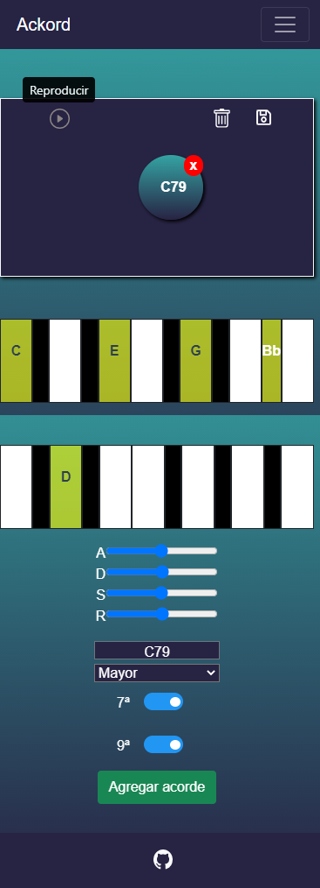

# Ackord

Ackord es una SPA desarrollada con el framework Vue.js, destinada a la creación de progresiones armónicas. Nos permite reproducir tanto acordes, como secuencias de ellos mediante el uso de la librería Tone.js. Las notas que componen cada acorde y el nombre que se le da a el mismo, son obtenidos de la API Uberchord y Las progresiones creadas son almacenadas en  Firestore, base de datos de Firebase, pudiendo gestionar nuestros datos 
 desde la app web.

https://ackord-a9594.web.app/

```
Usuario para inicio de sesión

user: usuario1@ackord.com
pass: 654321
```



## Iniciar proyecto
_Estas instrucciones te permitirán obtener una copia del proyecto en funcionamiento en tu máquina local para propósitos de desarrollo y pruebas._

```
$ git clone git@github.com:eabarca138/Ackord.git
```
```
$ cd ./Ackord/
```
```
$ npm install
```
```
$ npm run serve
```

## Herramientas de desarrollo

### Lenguajes

```
- HTML5
```
```
- CSS3
```
```
- Javascript
```

### Pre-Procesador CSS
```
- Sass
```
### Frameworks
```
- Vue.js
```
```
- Bootstrap v4.6
```
```
- BootstrapVue
```
### Librerías
```
- Vuex
```
```
- Vue Router
```
```
- Axios
```
```
- Tone.js
```
```
- vuex-persistedstate
```
### Base de datos
```
- Cloud Firestore
```
### Deploy y hosting.
```
- Firebase
``` 
### Línea de comandos
```
- Vue-CLI
```
### Gestor de paquetes
```
- NPM
```